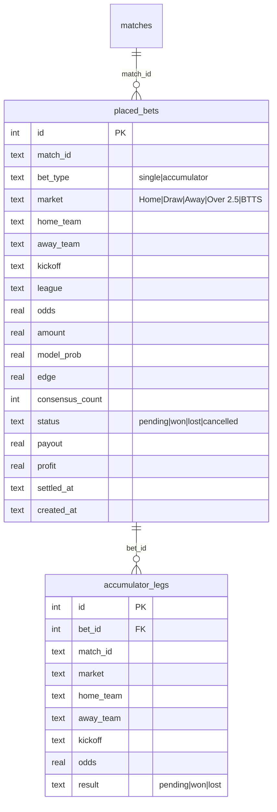

# Betting Tracking - Spor innsats og gevinst

## Overview

Komplett system for a spore plasserte spill i BetBot. Brukeren klikker pa en value bet eller kombispill-rad, registrerer innsats og justert odds i en modal, og systemet sporer automatisk resultater nar kampdata lastes ned. To nye kompakte dashboard-kort viser aktive spill og totalregnskap, og en ny "Kuponger"-fane gir full oversikt over historikk.

## Proposed Solution

Bygger pa eksisterende monstre: SQLite + raw SQL i backend, FastAPI routes med Pydantic-modeller, React-frontend med shadcn/ui-komponenter og hooks for datahenting.

### Arkitektur

```
placed_bets (SQLite)     POST /api/bets
accumulator_legs (SQLite) GET  /api/bets
                          GET  /api/bets/summary
                          GET  /api/bets/placed-ids
                          DELETE /api/bets/{id}
                               |
                    React: useBets() hook
                               |
          ┌────────────────────┼────────────────────┐
          v                    v                    v
   BetModal.tsx        CouponsCard.tsx    MetricCards (2 stk)
   (fra predictions)   (ny fane)         (Aktive spill, Totalregnskap)
```

### ER-diagram



## Implementation Phases

### Phase 1: Database og Backend

**1.1 Database-tabell og repository** (`src/data/bet_repository.py` - ny fil)

Folger data_processor.py-monsteret med raw SQLite:

```python
class BetRepository:
    def __init__(self, db_path: str = "data/processed/betbot.db"):
        self.db_path = db_path
        self.init_tables()

    def init_tables(self):
        """CREATE TABLE IF NOT EXISTS for placed_bets og accumulator_legs."""

    def place_bet(self, bet: dict) -> int:
        """INSERT single bet, returner id."""

    def place_accumulator(self, bet: dict, legs: list[dict]) -> int:
        """INSERT accumulator + legs i transaksjon."""

    def get_bets(self, status: str | None = None, limit: int = 50) -> list[dict]:
        """Hent spill med optional filtrering, nyeste forst."""

    def get_summary(self) -> dict:
        """Aggregerte tall: aktive spill, total P&L, ROI."""

    def get_placed_match_ids(self) -> list[dict]:
        """Returner match_id+market for alle pending/won/lost bets (for radmarkering)."""

    def settle_bets(self, match_results: list[dict]) -> list[dict]:
        """Sjekk pending bets mot resultater, oppdater status/payout/profit."""

    def cancel_bet(self, bet_id: int) -> bool:
        """Sett status=cancelled."""
```

- `init_tables()` kalles fra `data_processor.init_database()` sa tabellene opprettes sammen med resten
- `settle_bets()` matcher pa `match_id` for single bets, sjekker alle legs for accumulators
- Akkumulatorer: vunnet kun hvis ALLE legs vunnet; payout = samlet_odds * amount

**1.2 API-ruter** (`src/api/routes/bets.py` - ny fil)

```python
router = APIRouter(prefix="/api/bets", tags=["bets"])

@router.post("")
def place_bet(bet: BetInput) -> BetResponse

@router.get("")
def list_bets(status: str | None = None, limit: int = 50) -> list[BetRecord]

@router.get("/summary")
def get_summary() -> BetSummary

@router.get("/placed-ids")
def get_placed_ids() -> list[PlacedBetRef]

@router.delete("/{bet_id}")
def cancel_bet(bet_id: int) -> dict
```

**1.3 Pydantic-modeller** (legg til i `src/api/models.py`)

```python
class BetInput(BaseModel):
    match_id: str | None = None  # None for akkumulatorer
    bet_type: str  # "single" | "accumulator"
    market: str | None = None
    home_team: str | None = None
    away_team: str | None = None
    kickoff: str | None = None
    league: str | None = None
    odds: float
    amount: float
    model_prob: float | None = None
    edge: float | None = None
    consensus_count: int | None = None
    legs: list[AccumulatorLegInput] | None = None

class AccumulatorLegInput(BaseModel):
    match_id: str
    market: str
    home_team: str
    away_team: str
    kickoff: str
    odds: float

class BetRecord(BaseModel):
    id: int
    match_id: str | None
    bet_type: str
    market: str | None
    home_team: str | None
    away_team: str | None
    kickoff: str | None
    league: str | None
    odds: float
    amount: float
    status: str
    payout: float | None
    profit: float | None
    created_at: str
    settled_at: str | None
    legs: list[AccumulatorLeg] | None = None

class AccumulatorLeg(BaseModel):
    match_id: str
    market: str
    home_team: str
    away_team: str
    kickoff: str
    odds: float
    result: str

class BetSummary(BaseModel):
    active_count: int
    active_amount: float
    total_staked: float
    total_payout: float
    net_profit: float
    roi_pct: float
    win_count: int
    loss_count: int

class PlacedBetRef(BaseModel):
    match_id: str
    market: str
    bet_type: str
```

**1.4 Registrer rute** (i `src/api/main.py`)

Legg til `from .routes import bets` og `app.include_router(bets.router)`.

**1.5 Automatisk oppgjor ved download**

I task-flyten som kjorer etter download (i `src/api/services/task_manager.py` eller `src/services/tasks.py`):

- Etter at nye kampresultater er lagret i databasen
- Kall `bet_repository.settle_bets()` med de nye resultatene
- Sjekk: for single bets, match `match_id` og evaluer `market` mot faktisk resultat
- For akkumulatorer: sjekk hver leg, sett accumulator til won kun hvis alle legs won
- Beregn `payout` (odds * amount for won, 0 for lost) og `profit` (payout - amount)

Resultat-matching logikk:
| Market | Won-betingelse |
|--------|---------------|
| Home | result == 'H' |
| Draw | result == 'D' |
| Away | result == 'A' |
| Over 2.5 | total_goals > 2.5 |
| BTTS | btts == 1 |

---

### Phase 2: Frontend - Modal og radmarkering

**2.1 TypeScript-typer** (legg til i `web/src/types/index.ts`)

Speiler Pydantic-modellene 1:1 (BetRecord, BetSummary, BetInput, PlacedBetRef, AccumulatorLeg).

**2.2 API-klient** (legg til i `web/src/lib/api.ts`)

```typescript
// Betting
placeBet: (bet: BetInput) =>
  fetchJSON<{ id: number }>('/api/bets', {
    method: 'POST',
    headers: { 'Content-Type': 'application/json' },
    body: JSON.stringify(bet),
  }),
getBets: (status?: string, limit = 50) =>
  fetchJSON<BetRecord[]>(`/api/bets?${new URLSearchParams({ ...(status && { status }), limit: String(limit) })}`),
getBetSummary: () => fetchJSON<BetSummary>('/api/bets/summary'),
getPlacedIds: () => fetchJSON<PlacedBetRef[]>('/api/bets/placed-ids'),
cancelBet: (id: number) =>
  fetchJSON<{ status: string }>(`/api/bets/${id}`, { method: 'DELETE' }),
```

**2.3 useBets hook** (`web/src/hooks/useBets.ts` - ny fil)

Folger eksisterende hook-monster:

```typescript
export function useBets() {
  const [summary, setSummary] = useState<BetSummary | null>(null)
  const [bets, setBets] = useState<BetRecord[]>([])
  const [placedIds, setPlacedIds] = useState<PlacedBetRef[]>([])
  const [loading, setLoading] = useState(true)

  const refresh = useCallback(async () => { ... }, [])

  useEffect(() => { refresh() }, [refresh])

  const placeBet = useCallback(async (bet: BetInput) => {
    await api.placeBet(bet)
    refresh()
  }, [refresh])

  return { summary, bets, placedIds, loading, refresh, placeBet }
}
```

**2.4 BetModal** (`web/src/components/bets/BetModal.tsx` - ny fil)

shadcn Dialog-komponent:

- **Trigges av**: klikk pa rad i PredictionsCard eller SafePicksCard
- **Innhold**:
  - Kampinfo (lag, liga, avspark) - read-only
  - Marked (Home/Draw/Away/Over 2.5/BTTS) - read-only
  - Odds-felt - pre-fylt fra prediksjon, redigerbart input
  - Hurtigvalg-knapper: 10, 25, 50, 100 kr (klikk setter belopet)
  - Fritekst-felt for egendefinert belop
  - "Mulig gevinst: X kr" - beregnet live (odds * belop)
  - "Plasser spill"-knapp (POST til /api/bets)
- **For kombispill**: Viser liste over legs med samlet odds, kun odds + belop er redigerbart
- **Etter plassering**: Modal lukkes, data refreshes, rad markeres

**2.5 Radmarkering i PredictionsCard og SafePicksCard**

- Hent `placedIds` fra `useBets()` hook
- I TableRow: sjekk om `(match_id, market)` finnes i `placedIds`
- Hvis ja: legg til `className="bg-green-500/10"` (svak gronn bakgrunn)
- Vis et lite ikon (CheckCircle eller Banknote) i raden

Krev endringer i:
- `web/src/components/predictions/PredictionsCard.tsx` - legg til klikk-handler og markering
- `web/src/components/predictions/SafePicksCard.tsx` - samme for kombispill
- `web/src/App.tsx` - wire opp useBets og pass placedIds/placeBet ned

---

### Phase 3: Frontend - Kuponger-fane og dashboard-kort

**3.1 CouponsCard** (`web/src/components/bets/CouponsCard.tsx` - ny fil)

Ny fane i PredictionsTabs: "Kuponger"

- Tabell med kolonner: Dato | Kamp | Marked | Odds | Innsats | Status | Gevinst
- Kombispill viser "Kombi (3 kamper)" - klikk for a ekspandere legs
- Filtrering med Tabs eller Select: Alle / Aktive / Avgjorte / Vunnet / Tapt
- Status-badge med fargekoding:
  - `pending` → gul/noytral badge
  - `won` → gronn badge + gevinst-belop
  - `lost` → rod badge
  - `cancelled` → gra badge
- Kanseller-knapp (X) for pending bets
- Sortert med nyeste forst

**3.2 PredictionsTabs-oppdatering** (`web/src/components/predictions/PredictionsTabs.tsx`)

Legg til ny tab "Kuponger" som rendrer CouponsCard.

**3.3 Kompakte dashboard-kort**

Legg til i StatusMetricsRow (eller ny rad under):

**"Aktive spill"** - MetricCard:
- value: `{active_count} spill`
- footer: `{active_amount} kr i spill`

**"Totalregnskap"** - MetricCard:
- value: `{net_profit} kr` (gronn hvis positiv, rod hvis negativ)
- footer: `ROI: {roi_pct}%`
- description: `{win_count}V / {loss_count}T`

Bruker eksisterende MetricCard-monster fra StatusMetricsRow.

**3.4 Data-refresh etter tasks**

I `App.tsx`, legg til `refreshBets()` i task-completion-handleren:

```typescript
if (task.finished && !prevFinishedRef.current) {
  refreshStatus()
  refreshResults()
  refreshPredictions()
  refreshBets()  // <-- ny
}
```

## Acceptance Criteria

- [ ] Klikk pa value bet-rad apner modal med odds, hurtigvalg og belopsfelt
- [ ] Klikk pa kombispill-rad apner modal med legs og samlet odds
- [ ] Odds kan justeres i modalen (pre-fylt fra prediksjon)
- [ ] Hurtigvalg 10/25/50/100 setter belop, mulig gevinst oppdateres live
- [ ] Plassert spill lagres i SQLite med alle relevante felter
- [ ] Rader med plassert spill markeres visuelt (annen bakgrunnsfarge)
- [ ] "Kuponger"-fane viser alle plasserte spill med status og filtrering
- [ ] Kombispill vises som en rad med mulighet for a se legs
- [ ] "Aktive spill"-kort viser antall og belop i spill
- [ ] "Totalregnskap"-kort viser netto P&L og ROI
- [ ] Nar resultater lastes ned sjekkes pending bets og status/payout oppdateres automatisk
- [ ] Pending bets kan kanselleres

## Filendringer

### Nye filer

| Fil | Beskrivelse |
|-----|-------------|
| `src/data/bet_repository.py` | SQLite repository for placed_bets og accumulator_legs |
| `src/api/routes/bets.py` | FastAPI-ruter for betting |
| `web/src/components/bets/BetModal.tsx` | Modal for innsatsregistrering |
| `web/src/components/bets/CouponsCard.tsx` | Kuponger-fane med historikk |
| `web/src/hooks/useBets.ts` | React hook for betting-data |

### Endrede filer

| Fil | Endring |
|-----|---------|
| `src/api/models.py` | Nye Pydantic-modeller for bets |
| `src/api/main.py` | Registrer bets-router |
| `src/data/data_processor.py` | Kall `bet_repository.init_tables()` fra `init_database()` |
| `src/services/tasks.py` eller `src/api/services/task_manager.py` | Kall settle_bets etter download |
| `web/src/types/index.ts` | Nye TypeScript-interfaces |
| `web/src/lib/api.ts` | Nye API-kall for bets |
| `web/src/App.tsx` | Wire useBets, pass props, refresh etter tasks |
| `web/src/components/predictions/PredictionsTabs.tsx` | Ny "Kuponger"-tab |
| `web/src/components/predictions/PredictionsCard.tsx` | Klikk-handler og radmarkering |
| `web/src/components/predictions/SafePicksCard.tsx` | Klikk-handler for kombispill |
| `web/src/components/dashboard/StatusMetricsRow.tsx` | To nye MetricCards |

## Sources

- **Origin brainstorm:** [docs/brainstorms/2026-03-05-betting-tracking-brainstorm.md](docs/brainstorms/2026-03-05-betting-tracking-brainstorm.md)
- Database-monster: `src/data/data_processor.py`
- API-rute-monster: `src/api/routes/predictions.py`
- Frontend card-monster: `web/src/components/predictions/PredictionsCard.tsx`
- MetricCard-monster: `web/src/components/dashboard/StatusMetricsRow.tsx`
- Hook-monster: `web/src/hooks/usePredictions.ts`
- API-klient: `web/src/lib/api.ts`
- Task-refresh: `web/src/App.tsx`
